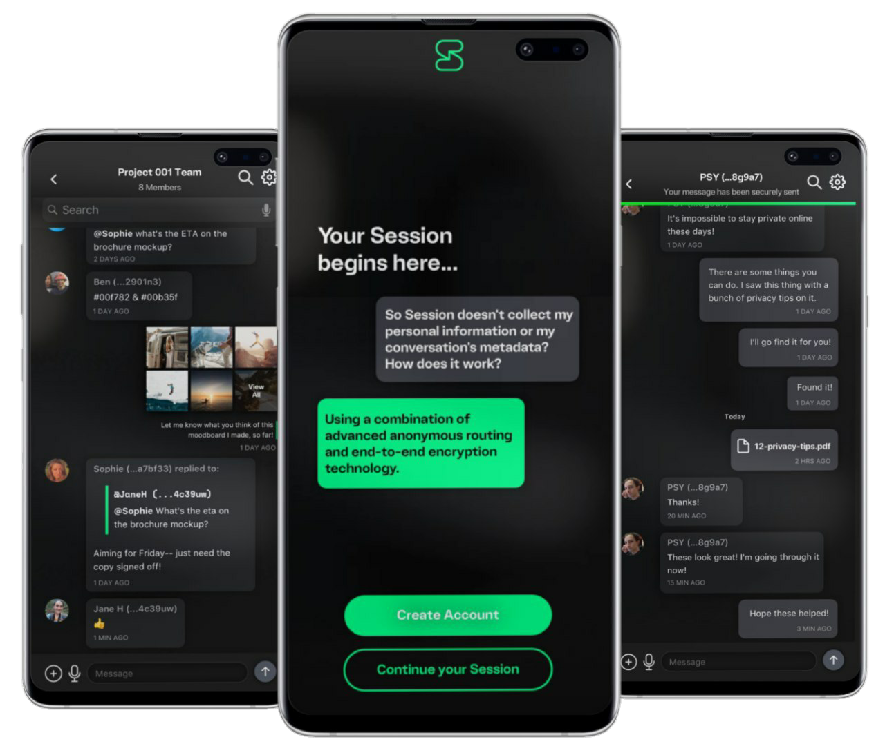

title: Session Docs | Session | Decentralised end-to-end encrypted Private Messenger 
description: Session is an open-source, public-key-based secure messaging application which uses a set of decentralised storage servers and an onion routing protocol to send end-to-end encrypted messages with minimal exposure of user metadata. It does this while also providing common features of mainstream messaging applications. 

# Session

[Session](https://getsession.org) is an open-source, public-key-based secure messaging application which uses a set of decentralised storage servers and an [onion routing protocol](../infrastructure/#onion-requests) to send end-to-end encrypted messages with minimal exposure of user metadata. It does this while also providing common features of mainstream messaging applications. 

## Download Links

Head over to the Session website to get your Session download Links: 
[Download](https://getsession.org)

## Register Session Name

Head over to the [How to register Session/Wallet name guide](../HowToRegisterSessionNames/).

## Introduction

Over the past 10 years, there has been a significant increase in the usage of instant messengers, with the most widely-used messengers each having amassed over 1 billion users. The potential privacy and security shortfalls of many popular messaging applications have been widely discussed. Most current methods of protecting user data privacy are focused on encrypting the contents of messages, an approach which has been relatively successful. 

This wide deployment of end-to-end encryption (E2EE) does increase user privacy; however, it largely fails to address the growing use of metadata by corporate and state-level actors as a method of tracking user activity. In the context of private messaging, metadata includes the IP addresses and phone numbers of the participants, the time and quantity of sent messages, and the relationship each account has with other accounts. Increasingly, it is the existence and analysis of this metadata that poses a significant privacy risk to journalists, demonstrators and human rights activists.

Session is, in large part, a response to this growing risk; it attempts to build robust [metadata protection](../infrastructure/) on top of existing protocols, including the Signal protocol, which have already been proven to be effective in providing secure communication channels. 

Session works to reduce metadata collection in several ways:

Firstly, Session does not rely on central servers, instead using a decentralised network of thousands of economically [incentivised nodes](../../../ServiceNodes/SNOverview/) to perform all [core messaging functionality](../message_routing/). For those services where decentralisation is impractical, like storage of attachments and hosting of [large group chat channels](../group_chats/), Session allows users to self-host infrastructure, or rely on built-in encryption and metadata protection to mitigate trust concerns.

Secondly, Session ensures that IP addresses cannot be linked to messages sent or received by users. This is accomplished by using an onion routing protocol called [onion requests](../infrastructure/#onion-requests). 

Thirdly, Session does not ask or require users to provide a phone number or email address when registering a new account. Instead, it uses [pseudonymous public-private key pairs](../infrastructure/#identity-and-long-term-keys) as the basis of an account’s identity.

